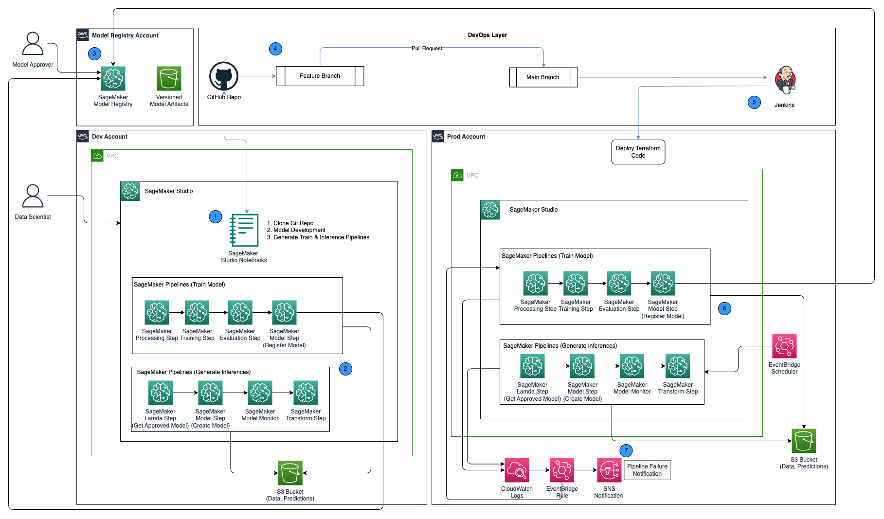

# Promotion of Pipelines in a Multi-Environment Setup with automated model retraining using Amazon SageMaker Model Registry, HashiCorp Terraform, GitHub and Jenkins CI/CD 

This repository shows how to create an MLOps framework using a combination of AWS services and third-party toolsets. The solution entails a multi-environment setup with automated model retraining, batch inference with model monitor, model versioning, and a CICD pipeline to facilitate promotion of ML code and pipelines across environments by using Amazon SageMaker, Amazon EventBridge, Amazon Simple Notification Service, HashiCorp Terraform, GitHub and Jenkins CI/CD. 

We build a model to predict the severity (benign or malignant) of a mammographic mass lesion trained with the XGBoost Algorithm using the publicly available [UCI Mammography Mass dataset](https://archive.ics.uci.edu/dataset/161/mammographic+mass) and deploy it on the MLOps framework. 

## Prerequisites
For this solution, you should have the following prerequisites:
-	Three AWS accounts
-	SageMaker Studio Domain setup across three AWS accounts 
-	Jenkins (we use Jenkins 2.401.1) with administrative privileges installed on AWS
-	Terraform version 1.5.5 or later installed on Jenkins server
-	Work out of us-east-1 region to deploy the solution. 

Follow instructions on blog to setup cross account access with IAM Roles, S3 Buckets,SageMaker Model Registry.

## Architecture Diagram

The following architecture diagram shows an overview of the MLOps framework.

## Deploy and Test the Solution

Follow these steps to deploy the solution into your AWS accounts:

1. Fork and clone the GitHub repository into dev account. 
2. Download the [UCI Mammography Mass dataset](https://archive.ics.uci.edu/dataset/161/mammographic+mass) and save it into a folder "data" within the cloned repo as well as the S3 Buckets provisioned in dev account.
3. Generate the datasets to train the model and generate predictions. Upload to the S3 Buckets in both dev and prod accounts.
4. Run execution of train pipeline to train the model and register model in central model registry account. 
5. Login into central model registry account and approve the model version.
6. Commit, push the code into repo, merge into main branch to create train and inference pipelines along with terraform code to provision infrastructure for Amazon EventBridge and Amazon SNS topic.
7. Trigger CICD pipeline setup on Jenkins to deploy the code to create ml pipelines and terraform infrastructure in prod account.
8. Optionally you can test the inference pipeline in prod account by manually triggering the pipeline in prod account to generate inferences using the batch without outliers dataset. 
9. Optionally you can also test the inference pipeline in prod account by using the batch with outliers dataset which fails the inference pipeline on the model monitor step and this triggers the train pipeline to retrain the model using the EventBridge rules setup in prod account. 

## Clean Up

To avoid incurring future charges, complete the following steps:

1.	Remove the SageMaker Studio Domain setup across all the AWS accounts.
2.	Delete all the resources created outside SageMaker including the S3 buckets, IAM roles along with the EventBridge rules and SNS Topic setup through terraform in prod account. 
3.	Delete the SageMaker Pipelines created across accounts using AWS CLI.

## Security
See CONTRIBUTING for more information.

## License
This library is licensed under the MIT-0 License. See the LICENSE file.

